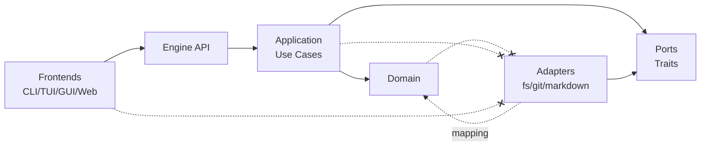

# Architecture

This document is the source of truth for Penna architecture.
If implementation and this document disagree, implementation is wrong.
Any architecture change must update this file in the same change.

## Core Principle

Penna is engine-first.
The engine is frontend-agnostic and owns business logic, data rules, and use cases.
Frontends are replaceable clients of the engine API.

## Layer Model

Penna follows a strict hexagonal architecture with inward dependencies.

| Layer | Responsibility | Allowed Dependencies | Forbidden Dependencies |
|---|---|---|---|
| Domain (`core/domain`) | Business entities, value objects, invariants | `std`, `serde` | `core/application`, `core/ports`, `adapters/*`, `engine/*`, frontend crates, I/O crates, `git2` |
| Application (`core/application`) | Use cases, orchestration, app-level errors | `core/domain`, `core/ports` | `adapters/*`, `engine/*`, frontend crates, direct I/O |
| Ports (`core/ports`) | Trait contracts for external concerns | `core/domain` types as needed | Adapter implementations, frontend crates |
| Adapters (`adapters/*`) | Concrete I/O implementations for ports | `core/domain`, `core/ports`, external I/O crates | Frontend crates, business rules |
| Engine API (`engine/*`) | Stable public API for frontends and hosts | `core/*`, selected `adapters/*` via wiring | Frontend-specific behavior |

## Dependency Rule

Dependencies point inward only:

1. Domain depends on nothing except `std` and `serde`.
2. Application depends only on Domain and Ports.
3. Ports expose interfaces only.
4. Adapters implement Ports.
5. Engine API calls Application use cases.
6. Frontends call Engine API only.

## Repository Mapping

| Path | Layer | Purpose |
|---|---|---|
| `core/domain/` | Domain | Pure domain model and invariants |
| `core/application/` | Application | One use case per file |
| `core/ports/` | Ports | External dependency contracts |
| `core/tests/` | Tests | Unit tests for domain and application |
| `adapters/fs/` | Adapter | Filesystem implementation of ports |
| `adapters/git/` | Adapter | Git-backed implementation of ports |
| `adapters/markdown/` | Adapter | Markdown import/export implementation |
| `engine/` | Engine API | Public engine boundary for consumers |
| `cli/`, `tui/`, `gui/` | Frontends | Optional clients of engine API |

## Operational Rules

1. Do not import outer layers into inner layers.
2. Do not add business logic to adapters.
3. Define or reuse a port trait before adding adapter behavior.
4. New use case in `core/application` requires a unit test in `core/tests`.
5. Markdown importer/exporter must degrade gracefully on malformed input.
6. Frontends must not call git/filesystem adapters directly.
7. Engine code must not contain frontend-specific UI assumptions.

## Definition Of Done (Architecture)

- Layer boundaries remain valid and compile.
- New use cases include tests.
- New adapters include integration coverage for real I/O where applicable.
- Public engine API remains frontend-agnostic.
- This document is updated when architecture changes.

## Related Documents

- [Data Model](./DATA_MODEL.md)
- [Architecture Decision Records](./ADR/)
- [Agent Rules](../AGENTS.md)
